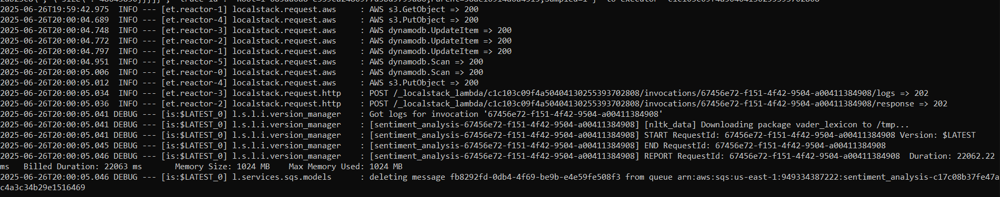

# DIC-Assignment-3

**Authors: 
Kienast Hanna (12020688) 
Kotala Jakub (12305828) 
Le Johannes (11918056) 
Tashkov Alexander (12123661)**

This repository contains the solution to Assignment 3 of **group 7** of the lecture Data-Intensive Computing. All tasks were done in Windows using the *Windows PowerShell* framework.  

## How to run this repository 

It is required to setup a environment as stated in the "Environment_Setup.pdf" file in TUWEL. We recommend to use Windows to run this repository but alternatively one can translate the instructions into bash commands, e.g. by using ChatGPT (such as we had to for the tutorial which uses Bash). 

Caution: All command lines may vary from your system, they only serve as examples. 

### Starting Localstack 

Start Docker and localstack as stated in the setup file. Alternatively, follow these instructions: 
- Open a new Powershell Window 
- Locate your virtual Python environment and activate it 
  + C:\Data_Science\DIC\assignment_3\.venv\Scripts\Activate.ps1  
- Change directory to your "localstack.exe" location 
  + cd C:\Data_Science\DIC\assignment_3 
- Run localstack with the following settings 
  + $env:LOCALSTACK_ACTIVATE_PRO="0"; $env:LOCALSTACK_DEBUG="1"; localstack start 

### Setup your Localstack 

In the following, we setup the lambdas and DynamoDB tables in our localstack. This can be done very easily by just running the "setup.ps1" file in Powershell. Alternatively, one can open the ps1-file using an editor and paste/translate the commands into a scripting language of your choice. 

- Open a new Powershell Window 
- Locate your virtual Python environment and activate it 
  + C:\Data_Science\DIC\assignment_3\.venv\Scripts\Activate.ps1 
- Change directory to the location of this repository on your system 
  + cd C:\Data_Science\DIC\assignment_3\DIC-Assignment-3 
- Run the setup file 
  + .\setup.ps1 

### Use the set-up localstack 

Now JSON files containing reviews can be uploaded to the localstack where they automatically get processed. If anything does not work as intended, please refer to the **Bugfixing** chapter. 

Processing takes time, so please wait till localstack is finished after uploading a file before taking further actions. The processing of the uploaded file is finished when you see something like this in localstack: 

- Upload the Reviews (you can also upload you own review-file, just replace "reviews_devset.json" with your filename): 
  + awslocal s3 cp .\reviews_devset.json s3://reviews-bucket-input/reviews_devset.json
- Check if outputs are created (should be 3 files):
  + awslocal s3 ls s3://reviews-bucket-output 
- Get the outputs:
  + awslocal s3 cp s3://reviews-bucket-output .\out --recursive 

The output files contain the following: 
- banned-users.json: 
 + Users which exceed 3 reviews containing profanity and should therefore be banned. 
 + Contains amount of reviews with profanity, their user ID and the ban-flag 
- reviews_devset.json: 
 + Contains the reviews of the input file but with tokenized review and summary texts and the new "has_profanity" and "sentiment" flags  
- total_counts.json 
 + Contains a summary of the reviews of various attributes 

### Running tests 

To run the tests, we use the same command window as before (you should be in this repository). 
Depending on your system use either of these commands: 
- pytest tests 
- $env:PYTHONPATH = "."; pytest tests

## BUGFIXING 

**Bug:** localstack started, ran setup file, uploaded data to input bucket - but the processes does not start: 
**Solution:** restart localstack and just do the same thing again 

**Bug:** uploaded review, localstack finished work but less than 3 files in the ouput-bucket: 
**Solution:** Check if the last lambda process in localstack was sentiment analysis and/or if the runtime is a round number, e.g. 180000 ms. If it is a round number than all the max runtime for that one process is used up -> increase "timeout" in "setup.ps1" file for that one lambda.  